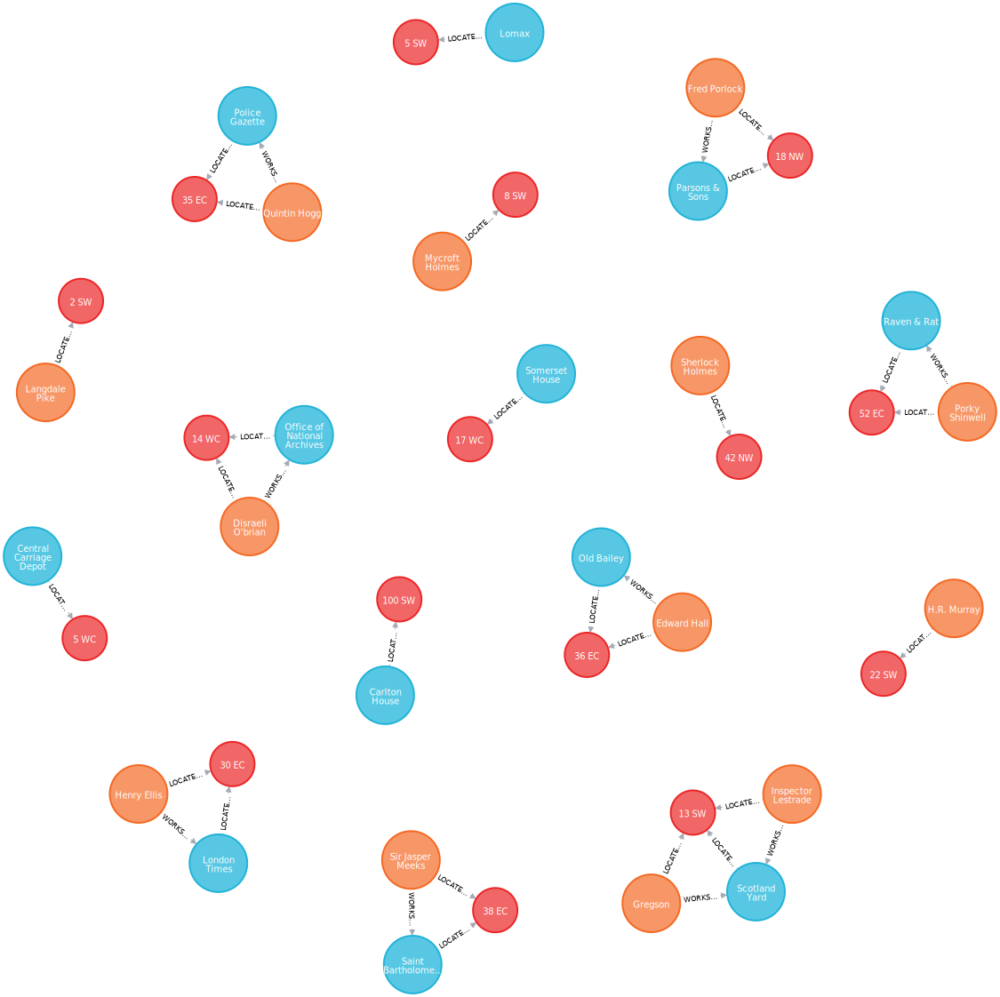

# Sherlock Holmes Consulting Detective Graph DB

See on this database the list of Informants and their location into a neo4j database.

Visual Studio Code [snippets](.vscode/CYPHER.code-snippets) included.

## How to

The easiest way to navigate this is to use `Docker` and point the data folder to this repository.

Run:

```bash
docker run --publish=7474:7474 --publish=7687:7687 \
--volume=/path/to/sherlock-holmes-neo4j/data:/data neo4j
```

The neo4j browser will be available at <http://localhost:7474>

